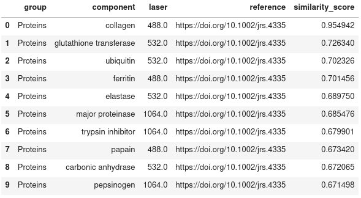
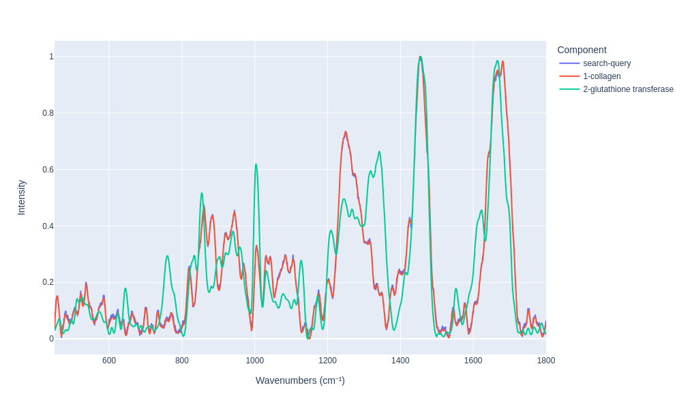
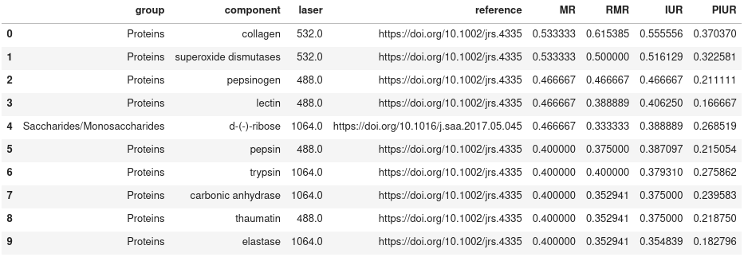
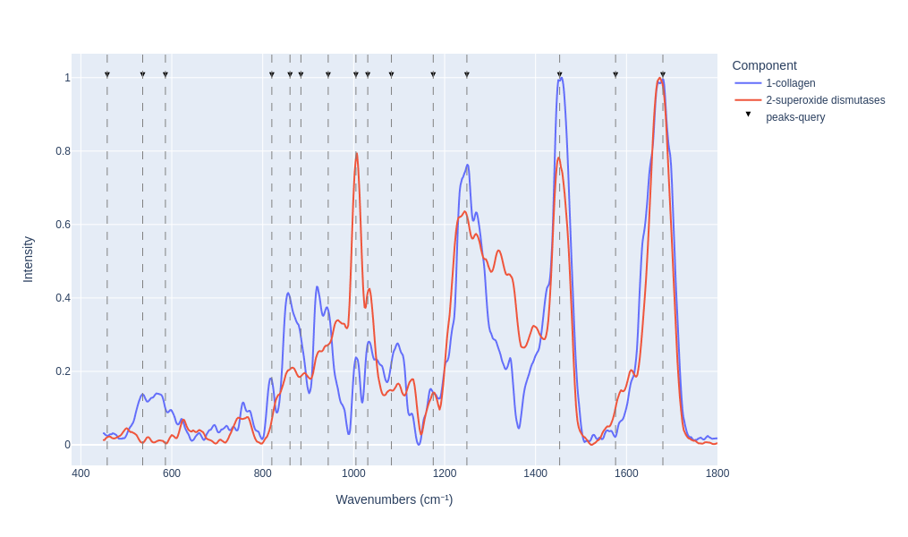

<picture align="center">
  
</picture>

> ⚠️ **Notice:** This tool is not yet published as the associated research article is currently under peer review. Once the review process is complete, the code and data will be made publicly available.

# RamanBiolib

A Raman spectral search library for biological molecules identification, over a database of 130 components, including lipids, proteins, carbohydrates, amino acids, metabolites, nucleic acids, pigments and others.

A spectra similarity or peak matching search algorithm can be used for the identification, based on the spectrum plot or the most relevant peaks positions. For the algorithms detail, see our article (TODO: add reference when the review is finished).

## Installation

```
pip install ramanbiolib
```

TODO: publish to pip when the review is finished

## Usage

### Spectra similarity search
Identify an unkown component by its Raman spectrum.

```
spectra_search = SpectraSimilaritySearch(wavenumbers=wavenumbers)
search_results = spectra_search.search(
    unknown_spectrum,
    class_filter=None,
    unique_components_in_results=True,
    similarity_method="slk",
    similarity_params=25 # Window size
)
```

Show the top N results

```
search_results.get_results(limit=10)
```


Visualy compare the results

```
search_results.plot_results(n=2)
```




### Peak matching search

Identify an unkown component by its Raman spectrum most relevant peaks positions.

```
pm_search = PeakMatchingSearch(wavenumbers=wavenumbers)
pm_search_results = pm_search.search(
        peaks_wavenumbers,
        tolerance=5,
        class_filter=None,
        sort_score='IUR',
        min_peak_intensity=0,
        tol_penalty="linear",
        unique_components_in_results=True
    )
```

Show the top N results

```
pm_search_results.get_results(limit=10, sort_col='IUR')
```




Visualy compare the results

```
pm_search_results.plot_results(n=2)
```



### Examples & Documentation

- [Search example notebook](./examples/search/search-example.ipynb)  

TODO: add documentation when the review is finished

## How to contribute with Raman spectra

TODO: Add after the review process is finished

## RamanBiolib Graphical User Interface (GUI)

For the GUI see the project RamanBiolib-UI

TODO: Add link after the review process is finished

## How to cite

TODO: add cite when is available

## License

The database files in this repository (the CSV files located in `./ramanbiolib/db` directory) are licensed under the **Open Database License (ODbL)**.

- You are free to copy, modify, and share the data, but any adaptations must also be licensed under the same terms (i.e., share-alike).
- You must attribute the source of the data.

See the full details of the Open Database License in the [LICENSE-ODbL](./LICENSE-ODbL) license file.


The code in this repository is licensed under **GNU General Public License v3**:

See the full details of the GNU General Public License v3 in the [GNU GPL v3](./LICENSE) license file.